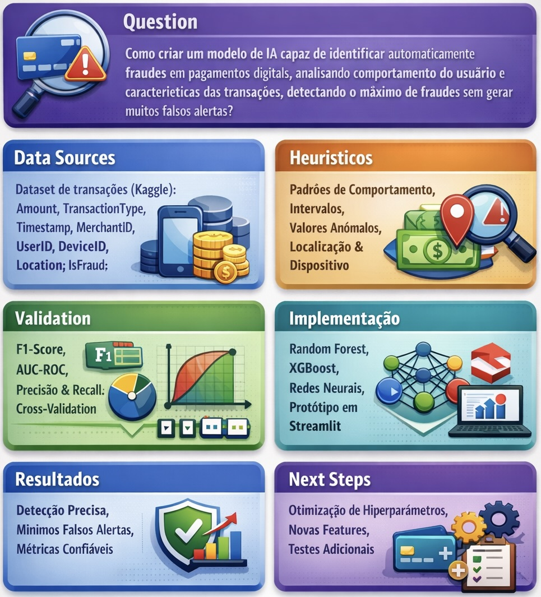

# Introdução

O aumento do uso de pagamentos digitais trouxe praticidade para usuários e instituições financeiras, mas também ampliou os riscos de fraudes eletrônicas. Nesse contexto, este projeto propõe o desenvolvimento de um modelo de Inteligência Artificial para identificar transações fraudulentas a partir da análise de características das operações e do comportamento dos usuários.

O objetivo é construir uma solução baseada em aprendizado de máquina capaz de detectar fraudes com bom desempenho e baixo índice de falsos alertas, contribuindo para a redução de perdas financeiras e o aumento da segurança em sistemas digitais. O projeto é direcionado principalmente a bancos, fintechs e plataformas de pagamento, além de beneficiar indiretamente os usuários desses serviços.

## Problema

O crescimento acelerado dos pagamentos digitais, como transferências eletrônicas, carteiras digitais e compras online, aumentou significativamente a exposição a fraudes financeiras. Transações fraudulentas geram prejuízos econômicos para instituições financeiras e empresas de tecnologia, além de comprometerem a confiança dos usuários nos sistemas digitais. O principal desafio está em identificar, de forma eficiente, quais transações são potencialmente fraudulentas em meio a um grande volume de operações legítimas.

Neste projeto, o problema investigado é a dificuldade de diferenciar transações legítimas de fraudulentas utilizando dados históricos de pagamentos digitais. A aplicação se insere no contexto de sistemas financeiros digitais e será desenvolvida em ambiente acadêmico, utilizando um dataset público disponível na plataforma Kaggle.

## Questão de pesquisa

Como desenvolver e avaliar um modelo de Inteligência Artificial capaz de identificar fraudes em pagamentos digitais a partir da análise das características das transações e do comportamento dos usuários, de modo a maximizar a detecção de fraudes e, ao mesmo tempo, minimizar a geração de falsos alertas?

Ao final do projeto, espera-se responder a essa questão por meio da experimentação com diferentes técnicas de aprendizado de máquina, análise de desempenho utilizando métricas adequadas (como precisão, recall, F1-score e AUC-ROC) e comparação dos resultados obtidos. A pesquisa buscará verificar se é possível construir um modelo confiável e aplicável ao contexto de sistemas financeiros digitais utilizando dados públicos disponíveis.

## Objetivos preliminares

O objetivo geral deste projeto é experimentar e avaliar modelos de aprendizado de máquina aplicados à detecção de fraudes em pagamentos digitais, buscando identificar a abordagem mais adequada para diferenciar transações legítimas de fraudulentas com bom desempenho.

Como objetivos específicos, destacam-se:

- **Objetivo específico 1:** Realizar análise exploratória e engenharia de atributos no dataset selecionado, identificando quais características das transações e do comportamento dos usuários são mais relevantes para a detecção de fraudes.

- **Objetivo específico 2:** Comparar diferentes algoritmos de aprendizado supervisionado (como Random Forest, XGBoost e Redes Neurais) quanto ao desempenho em métricas como precisão, recall, F1-score e AUC-ROC.

- **Objetivo específico 3:** Avaliar técnicas para tratamento de desbalanceamento de classes, analisando seu impacto na capacidade do modelo de detectar fraudes.

## Justificativa

O crescimento dos pagamentos digitais tem sido expressivo nos últimos anos, impulsionado pela expansão do comércio eletrônico, carteiras digitais e sistemas de transferência instantânea. No Brasil, o sistema Pix registrou mais de 40 bilhões de transações apenas em 2023, segundo dados do Banco Central do Brasil [(Banco Central do Brasil, 2024)](../docs/references.md). Esse volume evidencia a forte digitalização dos meios de pagamento no país e a crescente dependência de infraestruturas digitais para movimentações financeiras cotidianas.

Paralelamente, as perdas com fraudes em pagamentos digitais apresentam impacto econômico alarmante e em escala global. De acordo com o [*Nilson Report* (2023)](../docs/references.md), as perdas mundiais com fraudes em cartões atingiram US$ 33,83 bilhões em 2023, representando uma taxa de 6,58 centavos por cada US$ 100 transacionados. Somente nos Estados Unidos, as perdas chegaram a US$ 14,32 bilhões no mesmo período, em um volume total de US$ 13 trilhões em transações com cartões. Complementarmente, o relatório da [Juniper Research (2023)](../docs/references.md) projeta que as perdas globais de comerciantes com fraudes em pagamentos online somarão US$ 362 bilhões entre 2023 e 2028, podendo alcançar US$ 91 bilhões anuais até 2028, impulsionadas pelo crescimento do e-commerce em mercados emergentes e pelo uso crescente de inteligência artificial em ataques cibernéticos, como phishing, comprometimento de e-mail corporativo e *account takeover*.

Diante desse cenário, o estudo da detecção de fraudes é altamente relevante tanto no contexto acadêmico quanto profissional. Do ponto de vista técnico, o problema envolve desafios clássicos de aprendizado de máquina, como classificação binária e desbalanceamento severo de classes. Dal Pozzolo et al. (2015) demonstraram que técnicas de calibração de probabilidade com *undersampling* são essenciais para lidar com a proporção extremamente baixa de fraudes em relação a transações legítimas, enquanto [Leevy et al. (2018)](../docs/references.md) apresentaram um levantamento abrangente das técnicas de tratamento de desbalanceamento em contextos de *big data*, destacando a necessidade de abordagens como SMOTE (*Synthetic Minority Oversampling Technique*), *undersampling* e métodos de custo-sensível para evitar que modelos classifiquem todas as transações como legítimas [(Dal Pozzolo et al., 2015; Leevy et al., 2018)](../docs/references.md). A avaliação por métricas como F1-score e AUC-ROC, em vez da acurácia simples, é fundamental nesse contexto, já que a acurácia pode ser enganosamente alta em datasets desbalanceados. Profissionalmente, soluções eficazes podem reduzir perdas financeiras na ordem de bilhões de dólares, aumentar a segurança das transações e fortalecer a confiança dos usuários nos sistemas digitais.

A escolha de um dataset público de fraudes em pagamentos digitais permite a experimentação prática em um contexto realista e alinhado ao problema apresentado. Os objetivos específicos — como comparar diferentes algoritmos e avaliar técnicas para tratar o desbalanceamento de classes — estão diretamente relacionados ao desenvolvimento de modelos mais robustos e aplicáveis. Assim, o projeto contribui para a compreensão científica do problema e para a proposição de soluções com impacto econômico e social relevante.

## Público-Alvo

O projeto pode beneficiar diferentes perfis ligados ao ecossistema de pagamentos digitais. O primeiro grupo é composto por instituições financeiras, fintechs e empresas de tecnologia que operam sistemas de pagamento. Esses profissionais como analistas de risco, cientistas de dados e gestores de segurança da informação possuem conhecimento técnico sobre dados e tecnologia, além de responsabilidade na tomada de decisões relacionadas à prevenção de fraudes. Para esse público, a principal necessidade é reduzir perdas financeiras, melhorar a eficiência na detecção de transações suspeitas e apoiar decisões com base em dados.

Outro grupo impactado são os usuários de serviços de pagamento digital. Embora não interajam diretamente com o modelo desenvolvido, eles são beneficiados indiretamente por sistemas mais seguros e confiáveis. Esse público possui diferentes níveis de familiaridade com tecnologia, mas compartilha a expectativa de realizar transações rápidas, seguras e sem bloqueios indevidos. Assim, o projeto busca contribuir para um equilíbrio entre segurança e usabilidade, reduzindo fraudes sem gerar excesso de falsos alertas que possam prejudicar a experiência do usuário.

## Estado da arte

A detecção de fraudes em pagamentos digitais é um tema amplamente estudado devido ao aumento do uso de transações online e ao impacto econômico significativo das fraudes. Diversos trabalhos recentes exploram técnicas de aprendizado de máquina e inteligência artificial para identificar transações suspeitas em grandes volumes de dados financeiros. A literatura pode ser organizada em três abordagens principais: **métodos supervisionados tradicionais com *ensemble***, **detecção não supervisionada de anomalias** e **modelagem baseada em grafos**.

### Métodos supervisionados e *ensemble*

[Ileberi et al. (2022)](../docs/references.md) desenvolveram um *framework* de detecção de fraudes em cartões de crédito utilizando seis algoritmos de aprendizado de máquina — Support Vector Machine (SVM), Logistic Regression, Random Forest, XGBoost, Decision Tree e Extra Tree — combinados com Adaptive Boosting (AdaBoost) para melhoria de desempenho. Os autores empregaram SMOTE (*Synthetic Minority Oversampling Technique*) para tratar o desbalanceamento de classes em datasets reais de transações de cartão de crédito de portadores europeus, e validaram os resultados em um dataset sintético altamente enviesado. Os resultados demonstraram que o uso de AdaBoost teve impacto positivo significativo no desempenho dos classificadores, sendo avaliados por métricas como acurácia, recall, precisão, MCC (*Matthews Correlation Coefficient*) e AUC, superando abordagens existentes na literatura.

[Talukder et al. (2024)](../docs/references.md) propuseram um modelo *ensemble* híbrido que combina de forma inteligente múltiplos algoritmos — Decision Tree, Random Forest, K-Nearest Neighbor (KNN) e Multilayer Perceptron (MLP) — com otimização de pesos via *Grid Search*. Utilizando o dataset público de cartões de crédito com 284.807 transações e aplicando a técnica *Instant Hardness Threshold* (IHT) com Logistic Regression para tratamento de desbalanceamento, o modelo *ensemble* alcançou acurácia de 100%, superando os classificadores individuais (Decision Tree: 99,66%, Random Forest: 99,73%, KNN: 98,56%, MLP: 99,79%). Esse resultado estabeleceu um novo *benchmark* para detecção de fraudes em cenários de alta frequência transacional.

[Feng & Kim (2024)](../docs/references.md) exploraram uma abordagem comparativa entre Random Forest, XGBoost, Redes Neurais recorrentes e Autoencoders aplicados a dados temporais e monetários de transações, obtendo precisão superior a 90% na identificação de fraudes. O estudo contribuiu ao demonstrar a eficácia de técnicas variadas em diferentes aspectos das transações financeiras.

### Detecção não supervisionada de anomalias

[Breskuvienė & Dzemyda (2024)](../docs/references.md) aplicaram Self-Organizing Maps (SOM), uma técnica de aprendizado não supervisionado, para detecção de anomalias em dados financeiros. A abordagem demonstrou que padrões complexos de fraude podem ser capturados sem a necessidade de dados rotulados, o que é particularmente relevante em cenários onde a rotulação manual de transações é custosa ou impraticável. A principal contribuição reside na capacidade das SOMs de projetar dados de alta dimensionalidade em mapas bidimensionais, facilitando a visualização e interpretação de comportamentos anômalos.

### Modelagem baseada em grafos

[Singh et al. (2024)](../docs/references.md) apresentaram uma revisão abrangente de mais de 100 estudos sobre a aplicação de Graph Neural Networks (GNNs) na detecção de fraudes financeiras. A abordagem modela transações como grafos relacionando usuários, comerciantes e dispositivos, capturando padrões relacionais complexos que métodos tradicionais baseados em tabelas não conseguem representar. O estudo conclui que GNNs são "excepcionalmente eficazes na captura de padrões relacionais complexos e dinâmicos dentro de redes financeiras, superando significativamente métodos tradicionais de detecção de fraude". Apesar do alto desempenho em F1-score e AUC-ROC, os autores identificam desafios de escalabilidade e implantação em tempo real.

### Síntese e posicionamento do projeto

De forma geral, os estudos convergem em alguns pontos fundamentais: (i) fraudes são eventos raros e altamente desbalanceados, tipicamente representando menos de 1% das transações; (ii) o pré-processamento e a engenharia de atributos são determinantes para o desempenho dos modelos; (iii) métricas como F1-score e AUC-ROC são mais adequadas que a acurácia simples para avaliar modelos nesse contexto; e (iv) técnicas de *ensemble* tendem a superar classificadores individuais. Divergem, entretanto, quanto à abordagem ideal: enquanto Ileberi et al. e Talukder et al. focam em métodos supervisionados com *boosting* e *ensemble*, Breskuvienė & Dzemyda demonstram o potencial de abordagens não supervisionadas, e Singh et al. evidenciam ganhos com modelagem relacional via grafos.

Lacunas identificadas na literatura incluem: (i) a generalização dos modelos para diferentes datasets e domínios de pagamento; (ii) a avaliação de desempenho em cenários de tempo real com *concept drift* (mudança na distribuição dos dados ao longo do tempo); (iii) considerações éticas sobre privacidade e viés nos modelos; e (iv) a reprodutibilidade dos resultados com datasets públicos acessíveis.

O projeto deste repositório se alinha a essas pesquisas ao explorar aprendizado supervisionado com métricas como F1-score e AUC-ROC, incorporando pré-processamento e engenharia de atributos, e se diferencia ao: (i) utilizar um dataset público reprodutível de pagamentos digitais; (ii) comparar sistematicamente diferentes algoritmos e técnicas de tratamento de desbalanceamento; e (iii) incluir um protótipo demonstrativo que permite simular transações e visualizar previsões de fraude, aproximando o modelo acadêmico de um cenário aplicável.

# Descrição do _dataset_ selecionado

## Identificação e Origem
- **Nome:** Digital Payment Fraud Detection Dataset  
- **Fonte:** Kaggle  
- **Link de acesso:** [https://www.kaggle.com/datasets/jayjoshi37/digital-payment-fraud-detection](https://www.kaggle.com/datasets/jayjoshi37/digital-payment-fraud-detection)  
- **Licença de uso:** Licença de dados pública do Kaggle (uso acadêmico e não comercial permitido)

## Visão Geral
O dataset contém registros de transações digitais com o objetivo de identificar fraudes.  
- **Total de registros:** ~284.807 transações  
- **Total de atributos:** 8 principais  
- **Período coberto:** Dados históricos de transações financeiras, período específico não informado  
- **Contextualização:** Inclui transações legítimas e fraudulentas, permitindo treinar e avaliar modelos de aprendizado de máquina para detecção de fraude.

## Atributos Principais

| **Categoria**       | **Atributo**          | **Tipo**       | **Exemplo**             | **Descrição**                             | **Importância para detecção de fraude**             |
|-----------------|-----------------|-----------|-------------------|---------------------------------------|------------------------------------------------|
| Identificador 🆔| `transaction_id`| Categórico| T00012345         | Identificador único da transação      | Usado para referência, não como feature       |
| Financeiro 💰 | `transaction_amount`| Numérico| 150.75            | Valor da transação                     | Valores fora do padrão podem indicar fraude   |
| Financeiro 💰| `transaction_type`  | Categórico| Débito            | Tipo (crédito, débito, transferência) | Alguns tipos apresentam maior risco           |
| Temporal  ⏰| `transaction_hour`  | Numérico  | 23                | Hora da transação                      | Horários incomuns podem sinalizar fraude      |
| Dispositivo/Risco 🖥️ / 📱 / ⚠️ |`ip_risk_score`| Numérico  | 0.85  | Pontuação de risco do IP               | IPs suspeitos estão associados a fraude       |
| Comportamental 👤 | `user_id` | Categórico| U12345      | Identificador do usuário               | Histórico ajuda a detectar padrões suspeitos  |
| Dispositivo/Risco 🖥️ / 📱 / ⚠️| `device_type`| Categórico| Mobile | Dispositivo utilizado                  | Mudanças de dispositivo podem indicar fraude  |
| Dispositivo/Risco 🖥️ / 📱 / ⚠️ | `device_location` | Categórico| São Paulo, BR  | Local da transação  | Transações fora do padrão geográfico são suspeitas |
| Target 🎯 | `fraud_label`      | Binário   | 0 | Indica se a transação é fraude (1) ou não (0)        | Variável alvo para o modelo                   |

## Qualidade dos Dados
- **Valores faltantes:** Nenhum atributo crítico apresenta dados faltantes significativos.  
- **Inconsistências:** Alguns registros podem conter pequenas divergências nos campos categóricos, como variações de capitalização.  
- **Duplicatas:** Não identificadas, cada `TransactionID` é único.  
- **Outliers:** Valores de `Amount` extremamente altos ou baixos podem existir; será necessário tratamento na análise exploratória.

# Canvas analítico

# 🎬 Vídeo de apresentação da Etapa 01

Este vídeo apresenta a primeira etapa do projeto: **definição do contexto e levantamento de dados.** Mostramos como estruturamos o problema e coletamos as informações essenciais para análise de fraude em pagamentos digitais.

A apresentação poderá ser vista pelo seguinte link: https://youtu.be/xVXJk0D0Ryw

